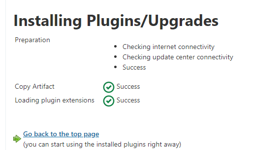
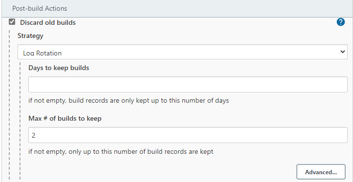
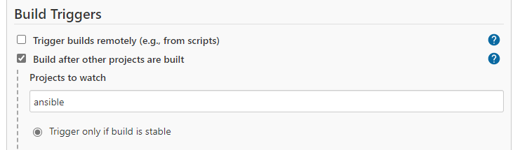
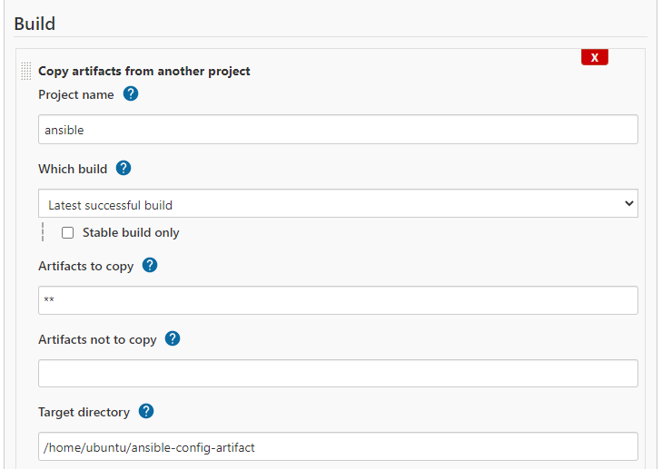
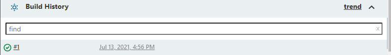
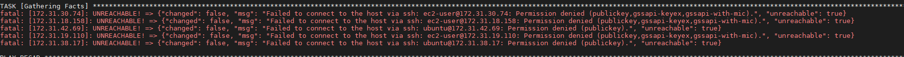
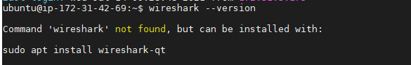
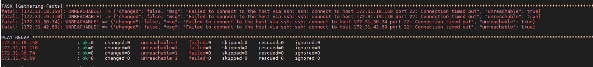
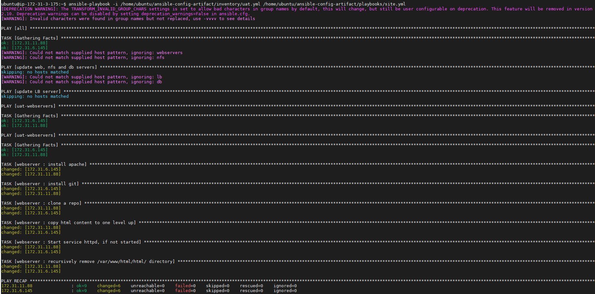
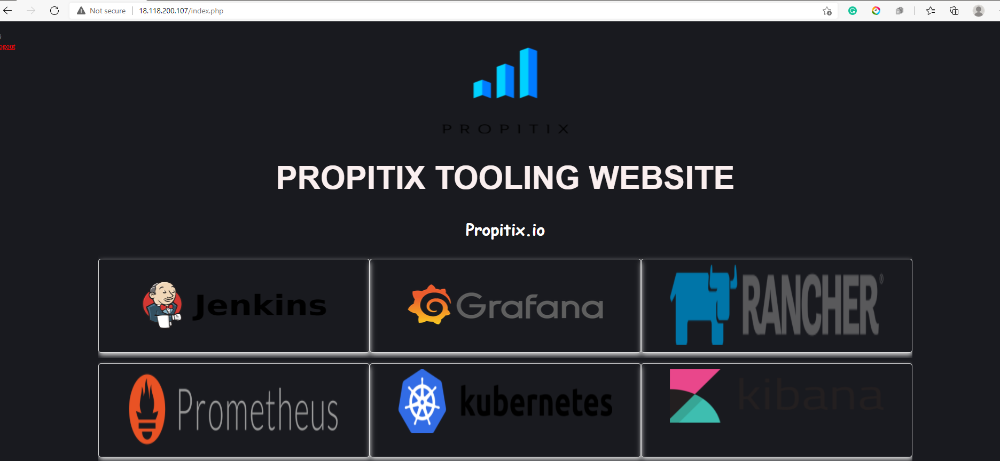

# Ansible Refactoring & Static Assignments (Imports and Roles)
## Jenkins Job enhancement

### Go to Jenkins-Ansible server and create new directory - ansible-config-artifact
>  sudo mkdir ansible-config-artifact

### Change permissions to this directory, so Jenkins could save files there 
> sudo chmod -R 0777 ansible-config-artifact

### Go to Jenkins web console -> Manage Jenkins -> Manage Plugins -> on Available tab search for Copy Artifact and install this plugin without restarting Jenkins


### Create a new Freestyle project (you have done it in Project 9) and name it save_artifacts. This project will be triggered by completion of your existing ansible project.







## Test new trigger by chaging README.md in master banch of ansible-config-artifact in github


- Build was automatically triggered after completion of 'ansible'
- Files are now saved in new server's 'ansible-config-artifact' directory

## Step 2 - Refactor Ansible code by importing other playbooks into site.yml
- Create new branch 'refactor'
- Create a 'site.yml' file in playbooks folder.
- Create a new folder in root of repository: static-assignments
- Move common.yml file into the newly created static-assignments folder.
- Inside site.yml file, import common.yml playbook.

### Create 'common-del.yml' in 'static-assignments' to configure deletion of wireshark utility

```yml
---
- name: update web, nfs and db servers
  hosts: webservers, nfs
  remote_user: ec2-user
  become: yes
  become_user: root
  tasks:
  - name: delete wireshark
    yum:
      name: wireshark
      state: removed

- name: update LB server
  hosts: lb, db
  remote_user: ubuntu
  become: yes
  become_user: root
  tasks:
  - name: delete wireshark
    apt:
      name: wireshark-qt
      state: absent
      autoremove: yes
      purge: yes
      autoclean: yes
```

### update site.yml with - import_playbook: ../static-assignments/common-del.yml instead of common.yml and run it against dev servers

> sudo ansible-playbook -i /home/ubuntu/ansible-config-artifact/inventory/dev.yml /home/ubuntu/ansible-config-artifact/playbooks/site.yaml

## That didnt work (SSH problems).

## I had to use:
> ansible-playbook -i /var/lib/jenkins/jobs/ansible/builds/20/archive/inventory/dev.yml /var/lib/jenkins/jobs/ansible/builds/20/archive/playbooks/site.yml

## Checking my db server for wireshark
> wireshark --version


## Step 3 - Configure UAT Webservers with a role ‘Webserver’
- Launch 2 fresh EC2 instances using RHEL 8 image, we will use them as our uat servers, so give them names accordingly - Web1-UAT and Web2-UAT.

- Use an Ansible utility called ansible-galaxy inside ansible-config-artifact/roles directory (you need to create roles directory upfront)

- Use an Ansible utility called ansible-galaxy inside ansible-config-artifact/roles directory (you need to create roles directory upfront)

```yml
[uat-webservers]
<Web1-UAT-Server-Private-IP-Address> ansible_ssh_user='ec2-user' ansible_ssh_private_key_file=<path-to-.pem-private-key>
<Web2-UAT-Server-Private-IP-Address> ansible_ssh_user='ec2-user' ansible_ssh_private_key_file=<path-to-.pem-private-key>
```

### In /etc/ansible/ansible.cfg file uncomment roles_path string and provide a full path to your roles directory roles_path = /home/ubuntu/ansible-config-artifact/roles, so Ansible could know where to find configured roles.

### It is time to start adding some logic to the webserver role. Go into tasks directory, and within the main.yml file, start writing configuration tasks to do the following:
- Install and configure Apache (httpd service)
- Clone Tooling website from GitHub https://github.com/<your-name>/tooling.git.
- Ensure the tooling website code is deployed to /var/www/html on each of 2 UAT Web servers.
- Make sure httpd service is started
```yml
---
- name: install apache
  become: true
  ansible.builtin.yum:
    name: "httpd"
    state: present

- name: install git
  become: true
  ansible.builtin.yum:
    name: "git"
    state: present

- name: clone a repo
  become: true
  ansible.builtin.git:
    repo: https://github.com/<your-name>/tooling.git
    dest: /var/www/html
    force: yes

- name: copy html content to one level up
  become: true
  command: cp -r /var/www/html/html/ /var/www/

- name: Start service httpd, if not started
  become: true
  ansible.builtin.service:
    name: httpd
    state: started

- name: recursively remove /var/www/html/html/ directory
  become: true
  ansible.builtin.file:
    path: /var/www/html/html
    state: absent`
```

## Step 4 - Reference ‘Webserver’ role
- Within the static-assignments folder, create a new assignment for uat-webservers uat-webservers.yml. This is where you will reference the role.
- you need to refer your uat-webservers.yml role inside site.yml.

So, we should have this in site.yml
```yml
---
- hosts: all
- import_playbook: ../static-assignments/common.yml

- hosts: uat-webservers
- import_playbook: ../static-assignments/uat-webservers.yml
```
## Step 5 - Commit & Test

Run this
> sudo ansible-playbook -i /home/ubuntu/ansible-config-artifact/inventory/uat.yml /home/ubuntu/ansible-config-artifact/playbooks/site.yml

## ERRor!!


Solution:
> sudo vi /etc/ansible/ansible.cfg

private_key_path=/home/ubuntu/.ssh/id_rsa



## Open web port for UAT servers
- Visit -server-IP-/index.php



# SUCCESS!